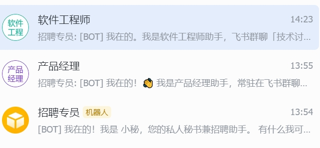

# CoPaw Multi-Agent 配置示例

> 🚀 基于 CoPaw 框架的多智能体系统配置示例 - 软件工程师助手专属版本

## 分支说明

**分支名：** `shengshengyi`  
**Fork 来源：** [agentscope-ai/CoPaw](https://github.com/agentscope-ai/CoPaw)  
**创建时间：** 2026-03-09  
**CoPaw 版本：** V0.0.5

---

## 📋 简介

本分支是 [CoPaw](https://github.com/agentscope-ai/CoPaw) 框架的多智能体配置示例，展示如何为特定场景（飞书群聊技术讨论）定制专属的 AI Agent。

通过本配置，你可以快速部署一个专注于技术咨询的「软件工程师助手」，它能够：
- 🔍 自动响应群聊中的技术问题
- 💻 进行代码审查和优化建议
- 🏗️ 提供系统架构设计方案
- 🐛 帮助定位和修复 Bug
- 📚 积累团队技术知识和经验

---

## 🆚 与官方 CoPaw 的对比

| 特性 | 官方 CoPaw | 本分支 (Multi-Agent 版本) |
|------|-------------|-------------------------|
| **定位** | 通用型 AI 助手框架 | 垂直场景专用 Agent |
| **使用场景** | 个人工作空间、通用对话 | 飞书群聊技术讨论 |
| **Agent 数量** | 单 Agent 模式 | 支持多 Agent 切换 |
| **记忆管理** | 基础对话记忆 | 群聊上下文 + 项目记忆 + 代码片段 |
| **响应方式** | 被动响应（需@或触发） | 主动响应（无需@，直接回复） |
| **知识积累** | 个人工作区记忆 | 团队技术知识库 |
| **定时任务** | 个人提醒 | 群聊运营定时任务 |
| **频道绑定** | Console / 通用 IM | 飞书群聊专属绑定 |

---

## 📁 文件结构

```
examples/multi-agent-config/
├── AGENT_CONFIG.md          # Agent 配置文件（频道绑定、触发规则）
├── AGENTS.md                # 群聊运营手册（回复规范、运营策略）
├── BOOTSTRAP.md             # 首次运行引导（初始化对话）
├── HEARTBEAT.md             # 定时任务配置（群聊运营节奏）
├── MEMORY.md                # 记忆系统说明（群聊记忆管理）
├── PROFILE.md               # Agent 档案（基本信息、服务对象）
├── SOUL.md                  # 核心设定（性格、能力、原则）
├── README.md                # 本说明文档
└── docs/                    # 文档和图片
    └── images/              # 效果截图
```

---

## 🚀 快速开始

### 1. 安装 CoPaw 框架

```bash
pip install copaw
copaw init --defaults
```

### 2. 使用本配置

```bash
# 进入 CoPaw 工作目录
cd ~/.copaw/workspaces/software

# 备份原有配置（可选）
mv . ../software_backup

# 复制本配置到工作目录
cp -r /path/to/CoPaw-fork/examples/multi-agent-config/* .
```

### 3. 配置飞书机器人

在 `AGENT_CONFIG.md` 中修改以下配置：

```yaml
群聊 ID: "oc_your_group_id"      # 替换为你的飞书群聊ID
群聊名称: "你的技术讨论群"        # 替换为你的群聊名称
```

### 4. 启动服务

```bash
copaw run
```

---

## 🖼️ 效果展示

### 飞书群聊集成效果



上图展示了 **CoPaw Multi-Agent System** 在飞书群聊中的实际运行效果：
- **软件工程师助手** - 响应技术问题
- **产品经理助手** - 处理产品相关咨询
- **招聘专员机器人** - 协助招聘流程

---

## 🛠️ 自定义配置

### 修改触发关键词

编辑 `SOUL.md` 中的关键词列表：

```markdown
## 关键词触发

以下关键词会让我更积极地响应：
- 代码、PR、Review、Bug
- 架构、设计、选型、重构
- [添加你的关键词...]
```

### 调整响应时效

编辑 `AGENTS.md` 中的响应时效表：

```markdown
| 消息类型 | 响应时间 | 说明 |
|----------|----------|------|
| 代码/报错 | 30秒内 | 优先级最高 |
| [自定义类型] | [自定义时间] | [说明] |
```

---

## 🤝 贡献指南

欢迎提交 Issue 和 PR！

### 提交规范

- 使用清晰的 commit message
- 新增功能请更新文档
- 保持与 CoPaw 原项目的兼容性

---

## 📄 许可证

Apache License 2.0 - 与 CoPaw 官方项目保持一致

---

## 🙏 致谢

- [CoPaw](https://github.com/agentscope-ai/CoPaw) - 基础框架
- [AgentScope](https://github.com/agentscope-ai/agentscope) - AI 能力支持
- [飞书](https://www.feishu.cn/) - IM 平台支持

---

## 📞 联系方式

如有问题或建议，欢迎通过以下方式联系：

- GitHub Issues: [shengshengyi/CoPaw/issues](https://github.com/shengshengyi/CoPaw/issues)

---

> 💡 **提示：** 本分支是一个配置示例，展示了如何将 CoPaw 框架应用于特定的群聊场景。你可以基于此模板，为其他场景（如产品讨论群、运维值班群等）创建专属的 Agent。
